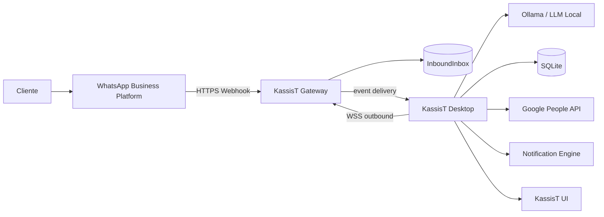

# KassisT — Especificação Oficial do Produto e Sistema

**Versão:** 1.0.0  
**Status:** Approved Technical Baseline / Ready for Repository Bootstrap  
**Data:** 22/08/2026  
**Produto/UI:** Português do Brasil  
**Código/contratos:** Inglês

**Versão:** 1.0.0  
**Status:** Approved Technical Baseline / Ready for Repository Bootstrap  
**Data:** 22/08/2026  
**Produto/UI:** Português do Brasil  
**Código/contratos:** Inglês

**Produto:** KassisT  
**Documento:** Especificação Oficial do Produto e Sistema  
**Versão:** 0.3.0  
**Status:** Specification Freeze & Consistency Pass — Proposed  
**Data:** 22/08/2026  
**Idioma do produto:** Português do Brasil  
**Plataforma inicial:** Windows 10/11 64-bit  
**Escopo:** MVP comercial local, preparado para evolução SaaS

---

## 0. Controle do documento

### 0.1 Objetivo

Este documento é o contrato de produto e arquitetura do KassisT. Ele consolida os requisitos fornecidos no briefing, decisões arquiteturais necessárias para torná-lo implementável, limites do MVP, critérios de aceitação, riscos, fluxos, modelo de dados e regras para desenvolvimento assistido por IA.

O briefing define explicitamente que o KassisT deve ser um produto real, não um experimento, e que a especificação deve servir como fonte única de verdade para múltiplas IAs, desenvolvedores e ferramentas. Também estabelece como diretrizes centrais: widget Windows compacto, atendimento de WhatsApp por LLM local, catálogo como conhecimento, cadastro de clientes, Google Contacts, notificações de venda, sons, métricas, logs, segurança, backup e possibilidade futura de SaaS. Essas diretrizes são preservadas nesta especificação.

### 0.2 Regras de leitura

- **MUST / DEVE:** obrigatório no escopo indicado.
- **SHOULD / DEVERIA:** recomendado, mas pode ser postergado com justificativa.
- **MAY / PODE:** opcional.
- **MVP:** obrigatório para a primeira versão comercial definida neste documento.
- **Future:** planejado, mas não bloqueia o MVP.
- **Open Decision:** depende de decisão humana ou validação externa.

### 0.3 Fonte de verdade e governança

A especificação é versionável. Alterações arquiteturais devem ser registradas em ADR e refletidas neste documento. Nenhuma IA pode redefinir unilateralmente uma decisão arquitetural registrada.

---

# 1. Executive Summary

## 1.1 O que é o KassisT

O KassisT é um aplicativo desktop para Windows que funciona como uma atendente virtual de WhatsApp para pequenos negócios, inicialmente uma sorveteria/picoleteria/açaiteria.

O sistema combina:

- uma interface desktop compacta e futurista;
- um widget circular flutuante;
- um núcleo local de negócio;
- uma LLM executada no computador por meio de Ollama;
- catálogo estruturado como base de conhecimento;
- atendimento automatizado;
- intervenção humana;
- motor determinístico de pedidos;
- gestão de clientes;
- sincronização opcional/automática com Google Contacts;
- notificações de venda;
- sons operacionais;
- dashboard e relatórios;
- logs e diagnóstico;
- backup e restauração;
- mecanismo de atualização para Windows.

## 1.2 Princípio central

> **A IA conversa. O sistema decide.**

A LLM não deve ser autoridade sobre preço, dinheiro, estoque, identidade, persistência, autorização ou estados críticos. Ela interpreta mensagens, identifica intenção, coleta dados e sugere ações estruturadas. O KassisT Core valida e executa.

## 1.3 Topologia recomendada

O MVP será predominantemente local, mas a integração profissional com WhatsApp utiliza um pequeno **KassisT Gateway** público para receber webhooks. O Gateway **não inicia conexões de entrada para a rede da loja**. O Desktop mantém uma conexão persistente de saída com o Gateway, evitando dependência de port forwarding, IP público ou exposição direta do Windows à internet.



### Transporte Gateway ↔ Desktop

O mecanismo padrão do MVP é **WebSocket seguro (WSS)**, iniciado pelo Desktop. O fluxo obrigatório é:

```text
WhatsApp
   ↓ HTTPS/Webhook
KassisT Gateway
   ↓
DomainOutbox
   ↓ WSS persistente iniciado pelo Desktop
KassisT Desktop
   ↓ ACK
Gateway marca entrega
```

Regras do transporte:

- o Desktop sempre inicia a conexão;
- cada instalação possui uma identidade de dispositivo própria;
- autenticação do dispositivo ocorre durante o handshake;
- eventos possuem `event_id` globalmente único;
- o Gateway entrega eventos pendentes após reconexão;
- o Desktop confirma recebimento com ACK;
- ACK perdido não pode gerar duplicação lógica;
- o Gateway conserva eventos até confirmação ou expiração definida pela política de retenção;
- reconexões usam backoff exponencial com jitter;
- o Gateway não executa regras de preço, estoque, pedido ou atendimento;
- nenhuma porta de entrada do Windows é necessária para o fluxo normal.

O Gateway é, portanto, uma camada de **transporte confiável e NAT/firewall-friendly outbound transport**, não o cérebro do produto.

---

# 2. Product Vision

## 2.1 Missão

Permitir que pequenos negócios ofereçam atendimento automático de vendas pelo WhatsApp sem exigir que a proprietária opere um sistema complexo durante o dia.

## 2.2 Visão

Tornar-se uma plataforma de atendimento e vendas local-first para pequenos negócios, capaz de evoluir para SaaS sem obrigar o usuário do MVP a compreender infraestrutura, prompts, modelos ou integrações.

## 2.3 Problema

Pequenos estabelecimentos recebem pedidos por WhatsApp, gastam tempo repetindo informações, podem perder mensagens, têm dificuldade de acompanhar pedidos e frequentemente não possuem ferramentas de análise simples.

## 2.4 Proposta de valor

O KassisT transforma o WhatsApp em um canal de atendimento e venda assistido por IA, com configuração simples e operação quase autônoma.

## 2.5 Diferenciais

1. IA local como opção padrão do MVP.
2. Regras críticas fora da LLM.
3. Interface desktop-first compacta.
4. Operação local mesmo sem um SaaS completo.
5. Intervenção humana nativa.
6. Conhecimento de negócio estruturado.
7. Observabilidade operacional.
8. Arquitetura preparada para cloud/SaaS.

## 2.6 Persona principal

Proprietário ou operador de pequeno negócio de alimentação, com pouca disponibilidade e baixa tolerância a complexidade técnica.

## 2.7 Limites do produto no MVP

O KassisT não será, inicialmente:

- um ERP;
- um sistema contábil;
- um sistema completo de estoque de nível industrial;
- um gateway de pagamento;
- um CRM empresarial completo;
- um sistema de roteirização de entregas;
- uma plataforma multi-tenant SaaS completa;
- um substituto absoluto para atendimento humano.

---

# 3. Escopo do MVP

## 3.1 Incluído

- Aplicativo Windows em Electron.
- React + TypeScript.
- Widget circular minimizado.
- Tray do Windows.
- Dashboard operacional.
- Atendimentos.
- Pedidos.
- Produtos.
- Clientes.
- Relatórios básicos.
- Configurações.
- Logs.
- Banco SQLite local.
- Ollama como camada inicial de LLM.
- Base de conhecimento estruturada.
- Motor determinístico de pedido.
- Atendimento automático.
- Assumir/pausar/devolver atendimento.
- Google Contacts via OAuth, sujeito à aprovação/configuração da aplicação Google.
- WhatsApp Business Platform/Cloud API como direção profissional recomendada.
- Gateway web mínimo para webhooks.
- Notificação de nova venda.
- Sons configuráveis.
- Backup e restauração.
- Health checks.
- Modo simulação.
- Installer Windows.
- Testes unitários, integração e E2E mínimos.

## 3.2 Pós-MVP

- Estoque quantitativo.
- Áudios e imagens entendidos pela IA de ponta a ponta.
- IA Insights avançado.
- Pagamento online.
- múltiplos usuários.
- licenciamento e billing.
- painel cloud.
- analytics multiempresa.
- sincronização entre dispositivos.
- SaaS multi-tenant.

---

# 4. Decisões arquiteturais consolidadas

| ID | Decisão | Status |
|---|---|---|
| ADR-001 | Electron + React + TypeScript | Obrigatória |
| ADR-002 | SQLite no MVP | Obrigatória |
| ADR-003 | Ollama como camada inicial de LLM local | Obrigatória |
| ADR-004 | Business Rules separadas da LLM | Obrigatória |
| ADR-005 | Widget circular + Windows Tray | Obrigatória |
| ADR-006 | Google People API via OAuth | Obrigatória, condicionada à homologação |
| ADR-007 | WhatsApp Business Platform/Cloud API | Direção oficial |
| ADR-008 | KassisT Gateway para integração externa | Obrigatória |
| ADR-009 | Desktop inicia conexão WSS outbound | Obrigatória |
| ADR-010 | Device authentication por Ed25519 challenge-response | Obrigatória |
| ADR-011 | Inbox/Outbox/Queue/EventBus/AuditLog separados | Obrigatória |
| ADR-012 | GitHub Secrets somente para CI/CD | Obrigatória |
| ADR-013 | Vercel/Firebase não são dependências do Desktop MVP | Obrigatória |
| ADR-014 | Delivery simples no MVP | Obrigatória |
| ADR-015 | Estoque binário no MVP | Obrigatória |
| ADR-016 | Pagamento como método registrado no MVP | Obrigatória |
| ADR-017 | Modo Simulação | Obrigatória |
| ADR-018 | `CONFIRMED` é o marco operacional da venda | Obrigatória |
| ADR-019 | KassisT é fonte operacional; Google é projeção sincronizada | Obrigatória |
| ADR-020 | Mudanças arquiteturais passam por ADR + versionamento | Obrigatória |

# 5. UX e experiência do produto

## 5.1 Princípio de uso

A proprietária configura uma vez e ativa. Depois:

```text
Ligar Windows
  ↓
KassisT inicia
  ↓
Health checks
  ↓
Integrações conectadas
  ↓
Widget minimizado
  ↓
Atendimento automático
```

A abertura do widget acontece apenas quando necessário.

## 5.2 Janela principal

Dimensões iniciais de referência, sujeitas a benchmark visual:

- largura: aproximadamente 1120–1360 px;
- altura: aproximadamente 680–820 px;
- mínimo funcional: aproximadamente 960 × 620 px.

Esses números são metas iniciais, não contratos de compatibilidade.

## 5.3 Navegação

Navegação principal recomendada:

1. Dashboard
2. Atendimentos
3. Pedidos
4. Produtos
5. Clientes
6. Relatórios
7. Configurações

Logs e Saúde podem ficar dentro de Configurações ou em um centro administrativo acessível pelo menu superior.

Isso consolida as ideias do briefing de abas operacionais e evita que Logs passem a competir com Atendimentos na navegação principal.

---

# 6. Widget minimizado

## 6.1 Forma

O estado minimizado é um círculo flutuante pequeno, com raio visual aproximado de 24–32 px, dimensionado para não atrapalhar outras aplicações.

## 6.2 Estados

| Estado | Indicador | Comportamento |
|---|---|---|
| Online | brilho/halo discreto | estado normal |
| Offline | indicador neutro/escuro | tooltip explica problema |
| Pausado | indicador âmbar | IA não responde |
| Nova mensagem | contador | animação curta |
| Atendimento humano | avatar/indicador humano | IA pausada naquela conversa |
| Pedido realizado | pulso curto | acompanha som |
| IA processando | animação discreta | sem excesso de movimento |
| Erro | alerta | clique abre diagnóstico |
| Sincronizando | spinner | temporário |

## 6.3 Interações

**Clique esquerdo:** abre/restaura janela principal.  
**Duplo clique:** abre diretamente Atendimentos.  
**Clique direito:** menu contextual.  
**Arrastar:** reposiciona widget.  
**Fechar widget:** apenas oculta widget; não encerra o processo, exceto se explicitamente configurado.  
**Fechar aplicativo pelo tray:** encerra o processo após confirmação se houver processamento crítico.

## 6.4 Menu contextual

- Abrir KassisT
- Nova mensagem: abrir atendimento
- Pedidos recentes
- Pausar IA global
- Retomar IA
- Modo simulação
- Saúde do sistema
- Configurações
- Sair

---

# 7. Dashboard

## Objetivo

Visão operacional da loja.

### KPIs canônicos

- Atendimentos ativos.
- Mensagens recebidas.
- Pedidos `CONFIRMED`.
- Faturamento operacional.
- Ticket médio.
- Clientes novos.
- Pedidos recentes.
- Estado das integrações.
- Alertas.

### Semântica

```text
Faturamento operacional =
sum(order.total_cents WHERE order.lifecycle_state = CONFIRMED)
```

Pedidos `CANCELLED` são excluídos.

Indicador futuro, separado:

```text
Valor entregue =
sum(order.total_cents WHERE order.lifecycle_state = DELIVERED)
```

Dashboard e Reports devem usar exatamente as mesmas regras.

A LLM e o Renderer nunca calculam métricas financeiras.

# 8. Atendimentos

## 8.1 Lista

Filtros:

- Todas.
- Novas.
- Em atendimento.
- Aguardando.
- Pedido em andamento.
- Pedido realizado.
- Aguardando humano.
- Finalizadas.

## 8.2 Cartão de conversa

Exibir:

- nome;
- telefone;
- última mensagem;
- hora;
- status;
- indicador de IA;
- mensagens não lidas;
- pedido associado;
- alerta.

## 8.3 Tela de conversa

Layout de três painéis:

```text
┌───────────────┬─────────────────────────┬─────────────────┐
│ Conversas     │ Conversa                │ Pedido          │
│               │                         │                 │
│ filtros       │ mensagens               │ carrinho        │
│ lista         │ entrada manual          │ totais          │
│               │ status IA/humano        │ endereço        │
│               │ ações                   │ pagamento       │
└───────────────┴─────────────────────────┴─────────────────┘
```

## 8.4 Ações humanas

- Assumir atendimento.
- Pausar IA.
- Devolver para IA.
- Enviar mensagem manual.
- Finalizar conversa.
- Reabrir conversa.
- Marcar como prioridade.
- Abrir cliente.
- Abrir pedido.

---

# 9. Máquina de estados da conversa

As máquinas de estado são independentes.

## ConversationLifecycle

```text
OPEN
CLOSED
```

## ConversationOwnership

```text
AI
HUMAN
```

## AIState

```text
ACTIVE
PAUSED
UNAVAILABLE
```

## MessageLifecycle

```text
RECEIVED
QUEUED
PROCESSING
SENT
DELIVERED
READ
FAILED
REJECTED
```

## OrderLifecycle

```text
DRAFT
CONFIRMED
IN_PRODUCTION
READY
OUT_FOR_DELIVERY
DELIVERED
CANCELLED
```

# 10. Motor de IA

## 10.1 Responsabilidades da IA

A IA pode:

- interpretar texto;
- identificar intenção;
- extrair itens e quantidades;
- fazer perguntas de esclarecimento;
- recomendar produtos conhecidos;
- responder perguntas apoiadas pela Knowledge Base;
- coletar endereço;
- identificar pedido de humano;
- resumir contexto.

## 10.2 Proibições

A IA não pode diretamente:

- inventar preço;
- inventar produto;
- aplicar desconto sem regra;
- criar pagamento real;
- mudar status crítico arbitrariamente;
- persistir diretamente no banco;
- acessar credenciais privadas;
- executar comandos de sistema não autorizados;
- alterar configurações sem ação explícita do usuário.

## 10.3 Perfil da atendente

Campos:

- nome da atendente;
- tom;
- formalidade;
- emojis;
- idioma;
- objetivo;
- regras de conversação;
- saudação;
- mensagem fora do horário;
- mensagem de transferência humana.

## 10.4 Exemplo de configuração funcional

```text
Nome: Kassis
Tom: Amigável
Formalidade: Casual
Emojis: Ativados
Objetivos:
  [x] Vender
  [x] Tirar dúvidas
  [x] Recomendar produtos
  [x] Registrar pedidos
Regras críticas:
  [x] Nunca inventar preços
  [x] Nunca confirmar sem resumo
  [x] Nunca confirmar sem endereço quando entrega
  [x] Nunca confirmar sem quantidade
```

---

# 11. Knowledge Center

## 11.1 Estrutura

Categorias:

- Loja.
- Produtos.
- Categorias.
- Preços.
- Complementos.
- Horários.
- Endereço.
- Área de entrega.
- Taxas.
- Formas de pagamento.
- Promoções.
- FAQ.
- Políticas.
- Observações.

## 11.2 Fonte de verdade

A fonte de verdade para dados operacionais é a base estruturada do KassisT. A LLM recebe contexto derivado dela.

## 11.3 Anti-alucinação

O sistema deve combinar:

1. Context injection da loja.
2. Ferramentas determinísticas de consulta.
3. Structured outputs.
4. Validação no Core.
5. Resposta segura quando não houver informação.

Exemplo:

```text
Pergunta: "Vocês entregam no bairro X?"

AI → consulta delivery_rules
        ↓
Engine → bairro permitido?
        ↓
SIM → responde com regra
NÃO/UNKNOWN → pede informação ou encaminha humano
```

A API do Ollama permite respostas estruturadas com JSON Schema e chamadas de ferramentas, o que pode ser usado para transformar a saída da LLM em intenções/ações verificáveis antes da execução. citeturn936616search1turn936616search2

---

# 12. Ollama e execução local

## 12.1 Papel

Ollama é a camada inicial de execução local de LLM. O produto deve depender de uma interface abstrata `LLMProvider`, e não de APIs específicas do Ollama espalhadas pelo código.

## 12.2 Capacidades usadas

- Chat.
- Structured output.
- Tool calling quando suportado pelo modelo.
- Timeout.
- Health check.
- Listagem/detecção de modelo.
- Configuração de temperatura.
- Limite de tokens.
- Contexto.

A API de chat do Ollama expõe mensagens, ferramentas, formato estruturado e opções de execução; a resposta também informa métricas de duração e tokens, úteis para observabilidade local. citeturn936616search2

## 12.3 Health check

```text
Ollama instalado?
↓
API responde?
↓
Modelo selecionado existe?
↓
Modelo aceita capacidade exigida?
↓
Teste de inferência
↓
READY
```

## 12.4 Fallback

MVP:

- nenhum fallback cloud automático por padrão;
- quando a LLM estiver indisponível, responder com estado controlado ou escalonar para humano;
- não fingir que a IA está funcionando.

## 12.5 Seleção do modelo

Configuração do usuário:

- modelo principal;
- parâmetros básicos;
- teste de conexão;
- botão para validar modelo.

Detalhes avançados ficam ocultos por padrão.

---

# 13. WhatsApp

## Direção oficial

A integração de produção utiliza **WhatsApp Business Platform / Cloud API** por meio de `MetaCloudWhatsAppProvider`.

Automação não oficial de WhatsApp Web não faz parte da arquitetura oficial.

## Entrada

```text
WhatsApp
↓ HTTPS/Webhook
Gateway
↓
InboundInbox
↓
Inbound Processor
↓
WSS EVENT
↓
Desktop
↓
SQLite InboundInbox
↓ COMMIT
ACK
↓
Message normalization
↓
Conversation Engine
```

## Saída

```text
Desktop
↓ WSS REQUEST
Gateway
↓
DomainOutbox / JobQueue
↓
MetaCloudWhatsAppProvider
↓
WhatsApp
```

## ACK

ACK significa:

> evento persistido localmente com sucesso.

Portanto:

```text
EVENT
↓
SQLite InboundInbox
↓ COMMIT
ACK
↓
IA/Human processing
```

Se o banco local falhar, o Desktop **não envia ACK**.

## Policy

Antes de envio:

```text
conversation state
opt-in/out
provider policy
window/template requirement
rate limit
```

A aplicação não deve codificar como permanente regras externas que possam mudar.

## Compliance gate

Antes do release comercial:

```text
[ ] número elegível
[ ] configuração Business concluída
[ ] webhook validado
[ ] permissões validadas
[ ] opt-in/opt-out
[ ] templates aplicáveis
[ ] rate limits
[ ] quality/policy monitoring
```

# 14. Google Contacts

## Direção

Utilizar Google People API por meio de `GoogleContactsSyncAdapter`.

KassisT é a fonte operacional de verdade. Google Contacts é uma projeção sincronizada.

## OAuth Desktop

```text
Desktop
↓
Browser externo
↓
OAuth
↓
PKCE
↓
Callback
↓
Refresh token
↓
Windows Secure Storage
```

O executável Desktop não contém `client_secret` secreto.

O `GOOGLE_DESKTOP_CLIENT_ID` pode ser público.

`GOOGLE_CLIENT_SECRET` só existe em eventual componente servidor que realmente necessite dele.

## Sincronização

```text
Customer created/updated
↓
Google Sync Job
↓
Search / create / update
↓
resourceName + etag
↓
SYNCED
```

O warm-up necessário para operações de busca é responsabilidade do adapter.

## Conflitos

```text
detect
↓
AuditLog
↓
CONFLICT
↓
não sobrescrever silenciosamente
```

Default: KassisT permanece como fonte operacional.

Falha Google nunca bloqueia venda.

O escopo de contatos e a verificação/revisão aplicável são release gates da integração.
# 15. Order Engine

## Regra fundamental

A LLM interpreta; o Order Engine decide.

### Commands

```text
CreateDraftOrder
AddItem
RemoveItem
ChangeQuantity
SetDeliveryType
SetAddress
SetPaymentMethod
ApplyEligiblePromotion
RecalculateOrder
RequestCustomerConfirmation
ConfirmOrder
CancelOrder
```

Cada comando possui:

```text
INPUT
PRECONDITIONS
BUSINESS RULES
OUTPUT
ERRORS
EVENTS
IDEMPOTENCY
```

## Invariantes

- quantidade é inteiro positivo;
- dinheiro usa centavos inteiros;
- total é calculado deterministicamente;
- LLM não escreve total;
- pedido confirmado não volta para DRAFT;
- estado terminal não reabre;
- item confirmado possui snapshot;
- modifier obedece disponibilidade/limites;
- promoção aplicada é estruturada;
- confirmação exige resumo final + confirmação inequívoca;
- evento `order.confirmed` é persistido na mesma transação.

## Monetário

```text
price_cents
subtotal_cents
discount_cents
delivery_fee_cents
total_cents
currency = BRL
```

Nunca usar `float`.

## Draft

```text
DRAFT = sempre recalculável
CONFIRMED = preço congelado
```

Alteração de catálogo antes de confirmar causa recálculo.

## Confirmação inequívoca

Um “sim” que simultaneamente introduza uma alteração não é confirmação final.
# 16. Fechamento automático da venda

```text
cliente escolhe
↓
Structured Intent
↓
validação determinística
↓
cálculo determinístico
↓
resumo final
↓
confirmação inequívoca
↓
Order Transaction
↓
CONFIRMED
```

Dentro da transação:

```text
Order
OrderItem
OrderItemModifier
OrderStatusHistory
order.confirmed
DomainOutbox
```

Depois do commit:

```text
EventBus → Sound/Toast/Badge/Dashboard
JobQueue → Google Sync
JobQueue → External Notification
```

Falhas de integração externa não desfazem a venda.
# 17. Clientes

## 17.1 Dados

- nome;
- telefone normalizado;
- endereços;
- observações;
- primeiro pedido;
- último pedido;
- número de pedidos;
- total gasto;
- origem;
- status.

## 17.2 Deduplicação

Chave primária prática inicial:

1. telefone normalizado + storeId.
2. Quando necessário, confirmação por nome/endereço.

Nunca criar um cliente novo apenas porque o nome veio escrito de forma diferente.

---

# 18. Notificações de venda

## Efeitos locais

```text
Sound
Toast
Badge
Dashboard
```

São eventos locais e podem usar `EventBus` após commit.

## Efeitos externos

```text
Google
WhatsApp notification
Future email/Telegram
```

Usam `JobQueue` + provider.

## Idempotência

```text
notification_key =
order_id + channel + template_version
```

Retry não pode produzir duplicatas involuntárias.

## Canal

`LocalNotificationProvider` é obrigatório no MVP.
